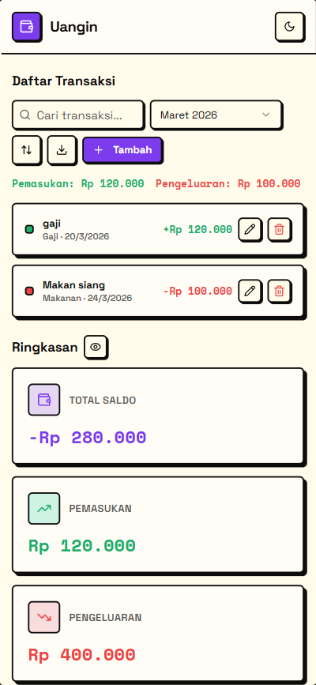
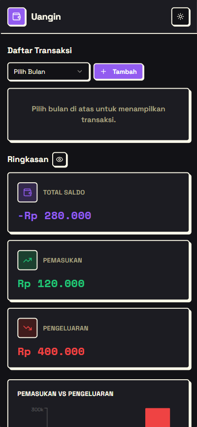

<div align="center">

# 💸 Uangin


Designed to help you manage, understand, and improve your cash flow

[**View Live Demo**](https://uangin.vercel.app)

</div>

## 📸 Preview
 

## Features

- 💰 **Transaction Management** - Track all your income and expenses in one place
- 📊 **Visual Analytics** - Charts and graphs to visualize your financial data
- 🎯 **Category Organization** - Organize transactions by customizable categories
- 💡 **Summary Cards** - Quick overview of your financial status
- 🌙 **Dark Mode** - Comfortable viewing in any lighting condition
- 📱 **Responsive Design** - Works seamlessly on desktop and mobile devices
- ⚡ **Real-time Updates** - Instant reflection of changes across the app

## Tech Stack

- **Frontend Framework:** React 18 with TypeScript
- **Build Tool:** Vite
- **Styling:** Tailwind CSS
- **UI Components:** shadcn/ui (Radix UI)

## Getting Started

### Prerequisites

- Node.js (v18 or higher)
- npm or yarn package manager

### Installation

1. Clone the repository
```bash
git clone https://github.com/kkornelius/uangin.git
cd uangin
```

2. Install dependencies
```bash
npm install
```

3. Start the development server
```bash
npm run dev
```

The application will be available at `http://localhost:8080`

## Features in Detail

### Transaction Management
Create, edit, and delete transactions with support for both income and expense types. Each transaction includes amount, category, description, and date.

### Financial Analytics
Visualize your spending patterns with interactive charts. Get insights into your monthly income and expenses at a glance.

### Categories
Pre-configured categories for income and expenses, with the flexibility to extend them based on your needs.

### Dark Mode
Toggle between light and dark themes for comfortable viewing at any time of day.

## License

This project is open source and available under the MIT License.


---

**Built with ❤️ for better financial management**
