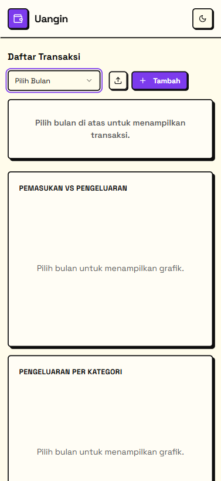
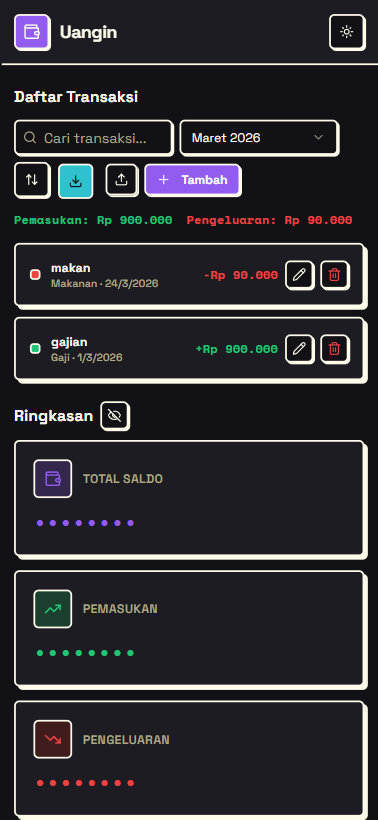

<div align="center">

# 💸 Uangin (Update)


Aplikasi keuangan sederhana untuk mencatat, menganalisis, dan mengelola pemasukan serta pengeluaran.

</div>

## � Screenshot


**Mode Gelap:**



## �📌 Ringkas
Uangin adalah aplikasi React + TypeScript dengan Vite dan Tailwind CSS yang membantu Anda:
- mencatat transaksi pemasukan dan pengeluaran
- melihat ringkasan bulanan dan saldo yang disensor saat belum memilih bulan
- mengekspor / mengimpor transaksi menggunakan CSV
- mengonfirmasi penghapusan transaksi agar tidak terhapus langsung
- memvisualisasikan data dalam grafik dan ringkasan yang lebih fokus per bulan

## ✨ Fitur Utama
- 📁 Tambah, edit, dan hapus transaksi
- 🗓️ Pilih bulan untuk melihat ringkasan dan daftar transaksi khusus bulan tersebut
- 🔒 Total saldo disembunyikan secara default sebelum bulan dipilih
- 📊 Ringkasan per bulan (bukan total keseluruhan)
- 📈 Grafik pendapatan vs pengeluaran dan distribusi kategori
- 📥 Impor CSV sesuai format unduhan
- 📤 Ekspor CSV data transaksi
- ✅ Konfirmasi sebelum menghapus transaksi
- 🌙 Dukungan dark mode dan desain responsif
- 💾 Data tersimpan di `localStorage`

## 📂 Format CSV
File CSV impor harus mengikuti format hasil ekspor:

```csv
Tanggal,Tipe,Kategori,Deskripsi,Jumlah
2024-06-01,Pemasukan,Gaji,"Gaji bulan Juni",5000000
2024-06-02,Pengeluaran,Makan,"Makan siang",50000
```

## 🚀 Setup Lokal
### Prasyarat
- Node.js v18+ 
- npm

### Instalasi
```bash
git clone https://github.com/kkornelius/uangin.git
cd uangin
npm install
```

### Jalankan
```bash
npm run dev
```

Akses aplikasi di `http://localhost:8081` (atau port lain yang dipilih Vite).

## 📦 Perintah NPM
- `npm run dev` - jalankan development server
- `npm run build` - bangun aplikasi untuk produksi
- `npm run preview` - lihat hasil build secara lokal
- `npm run lint` - jalankan ESLint
- `npm run test` - jalankan tes dengan Vitest

## 🧠 Teknologi
- React 18 + TypeScript
- Vite
- Tailwind CSS
- shadcn/ui / Radix UI
- Recharts
- Sonner toast

## 📌 Catatan
Aplikasi ini menyimpan data transaksi di browser menggunakan `localStorage`, jadi data akan tetap ada selama tidak dihapus dari browser.

## 📜 Lisensi
MIT

